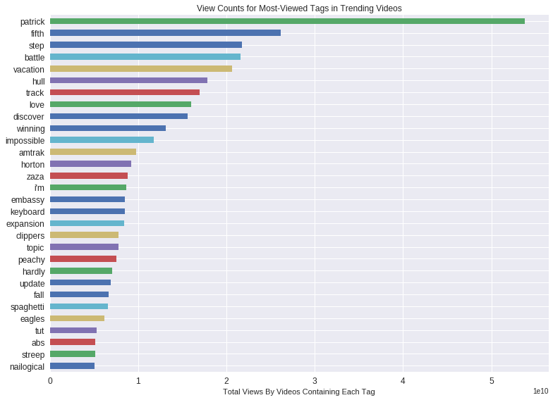

Thinkful Data Science Fundamentals Capstone Analysis

**Youtube Trending Video Statistics**


**Describing the Dataset**

This dataset is the daily record from the top trending YouTube videos. Top 200 trending videos of a given day. Original Data was collected during 14th November 2017 & 5th March 2018(though, data for January 10th & 11th of 2017 is missing). 

This dataset is an improved version of a series of parent datasets: 

* The original dataset was [Trending Youtube Video Statistics and Comments](http://https://www.kaggle.com/datasnaek/youtube/home), which was collected using Youtube's API, and contained files for different countries and files for comments. These were linked by the "unique_video_id" field.
* A subsequent dataset was structurally improved and named [Trending Youtube Video Statistics](http://https://www.kaggle.com/datasnaek/youtube-new/home), it still was based off one file per country, with the difference that now the comment files were now integrated into each country's file.
* Finnally, this dataset [YouTube Trending Video Statistics with Subscriber
](http://https://www.kaggle.com/sgonkaggle/youtube-trend-with-subscriber/home) is a fork off the US data only. It was further improved in minor ways and was added a "Subscriber" field, by automatically gathering data for each video's subscribers using the author's own Python scripts.


**Summary Statistics**

Let's explore this data.


```python
import numpy as np 
import pandas as pd 
import matplotlib.pyplot as plt
%matplotlib inline
```


```python
from google.colab import drive
drive.mount('/content/gdrive')
```

    Drive already mounted at /content/gdrive; to attempt to forcibly remount, call drive.mount("/content/gdrive", force_remount=True).


```python
import os
print(os.listdir())# we need to know the filename
```

    ['sample_data', '.config', 'gdrive']


```python
# import the file using pandas read_csv function
usvids = pd.read_csv('gdrive/My Drive/Data Science/JupyterNotebooks/DataSets/youtube-trend-with-subscriber/USvideos_modified.csv', index_col='video_id')
# let's see the columns
usvids.head(10)

```


<div>
<style scoped>
    .dataframe tbody tr th:only-of-type {
        vertical-align: middle;
    }

    .dataframe tbody tr th {
        vertical-align: top;
    }
    
    .dataframe thead th {
        text-align: right;
    }
</style>
<table border="1" class="dataframe">
  <thead>
    <tr style="text-align: right;">
      <th></th>
      <th>last_trending_date</th>
      <th>publish_date</th>
      <th>publish_hour</th>
      <th>category_id</th>
      <th>channel_title</th>
      <th>views</th>
      <th>likes</th>
      <th>dislikes</th>
      <th>comment_count</th>
      <th>comments_disabled</th>
      <th>...</th>
      <th>tag_appeared_in_title</th>
      <th>title</th>
      <th>tags</th>
      <th>description</th>
      <th>trend_day_count</th>
      <th>trend.publish.diff</th>
      <th>trend_tag_highest</th>
      <th>trend_tag_total</th>
      <th>tags_count</th>
      <th>subscriber</th>
    </tr>
    <tr>
      <th>video_id</th>
      <th></th>
      <th></th>
      <th></th>
      <th></th>
      <th></th>
      <th></th>
      <th></th>
      <th></th>
      <th></th>
      <th></th>
      <th></th>
      <th></th>
      <th></th>
      <th></th>
      <th></th>
      <th></th>
      <th></th>
      <th></th>
      <th></th>
      <th></th>
      <th></th>
    </tr>
  </thead>
  <tbody>
    <tr>
      <th>2kyS6SvSYSE</th>
      <td>2017-11-20</td>
      <td>2017-11-13</td>
      <td>17</td>
      <td>22</td>
      <td>CaseyNeistat</td>
      <td>2564903</td>
      <td>96321</td>
      <td>7972</td>
      <td>22149</td>
      <td>False</td>
      <td>...</td>
      <td>False</td>
      <td>WE WANT TO TALK ABOUT OUR MARRIAGE</td>
      <td>SHANtell martin</td>
      <td>SHANTELL'S CHANNEL - https://www.youtube.com/s...</td>
      <td>7</td>
      <td>7</td>
      <td>2</td>
      <td>2</td>
      <td>1</td>
      <td>9086142.0</td>
    </tr>
    <tr>
      <th>1ZAPwfrtAFY</th>
      <td>2017-11-20</td>
      <td>2017-11-13</td>
      <td>7</td>
      <td>24</td>
      <td>LastWeekTonight</td>
      <td>6109402</td>
      <td>151250</td>
      <td>11508</td>
      <td>19820</td>
      <td>False</td>
      <td>...</td>
      <td>False</td>
      <td>The Trump Presidency: Last Week Tonight with J...</td>
      <td>last week tonight trump presidency|last week t...</td>
      <td>One year after the presidential election, John...</td>
      <td>7</td>
      <td>7</td>
      <td>65</td>
      <td>69</td>
      <td>4</td>
      <td>5937292.0</td>
    </tr>
    <tr>
      <th>5qpjK5DgCt4</th>
      <td>2017-11-20</td>
      <td>2017-11-12</td>
      <td>19</td>
      <td>23</td>
      <td>Rudy Mancuso</td>
      <td>5315471</td>
      <td>187303</td>
      <td>7278</td>
      <td>9990</td>
      <td>False</td>
      <td>...</td>
      <td>True</td>
      <td>Racist Superman | Rudy Mancuso, King Bach &amp; Le...</td>
      <td>racist superman|rudy|mancuso|king|bach|racist|...</td>
      <td>WATCH MY PREVIOUS VIDEO ▶ \n\nSUBSCRIBE ► http...</td>
      <td>7</td>
      <td>8</td>
      <td>68</td>
      <td>426</td>
      <td>23</td>
      <td>4191209.0</td>
    </tr>
    <tr>
      <th>puqaWrEC7tY</th>
      <td>2017-11-20</td>
      <td>2017-11-13</td>
      <td>11</td>
      <td>24</td>
      <td>Good Mythical Morning</td>
      <td>913268</td>
      <td>16729</td>
      <td>1386</td>
      <td>2988</td>
      <td>False</td>
      <td>...</td>
      <td>True</td>
      <td>Nickelback Lyrics: Real or Fake?</td>
      <td>rhett and link|gmm|good mythical morning|rhett...</td>
      <td>Today we find out if Link is a Nickelback amat...</td>
      <td>7</td>
      <td>7</td>
      <td>488</td>
      <td>1246</td>
      <td>28</td>
      <td>13186408.0</td>
    </tr>
    <tr>
      <th>d380meD0W0M</th>
      <td>2017-11-19</td>
      <td>2017-11-12</td>
      <td>18</td>
      <td>24</td>
      <td>nigahiga</td>
      <td>2819118</td>
      <td>153395</td>
      <td>2416</td>
      <td>20573</td>
      <td>False</td>
      <td>...</td>
      <td>True</td>
      <td>I Dare You: GOING BALD!?</td>
      <td>ryan|higa|higatv|nigahiga|i dare you|idy|rhpc|...</td>
      <td>I know it's been a while since we did this sho...</td>
      <td>6</td>
      <td>7</td>
      <td>488</td>
      <td>1007</td>
      <td>14</td>
      <td>20563106.0</td>
    </tr>
    <tr>
      <th>gHZ1Qz0KiKM</th>
      <td>2017-11-20</td>
      <td>2017-11-13</td>
      <td>19</td>
      <td>28</td>
      <td>iJustine</td>
      <td>1038365</td>
      <td>22594</td>
      <td>2798</td>
      <td>3142</td>
      <td>False</td>
      <td>...</td>
      <td>True</td>
      <td>2 Weeks with iPhone X</td>
      <td>ijustine|week with iPhone X|iphone x|apple|iph...</td>
      <td>Thanks for watching! Don't forget to subscribe...</td>
      <td>7</td>
      <td>7</td>
      <td>38</td>
      <td>122</td>
      <td>7</td>
      <td>4652602.0</td>
    </tr>
    <tr>
      <th>39idVpFF7NQ</th>
      <td>2017-11-18</td>
      <td>2017-11-12</td>
      <td>5</td>
      <td>24</td>
      <td>Saturday Night Live</td>
      <td>2688797</td>
      <td>19042</td>
      <td>3059</td>
      <td>2689</td>
      <td>False</td>
      <td>...</td>
      <td>True</td>
      <td>Roy Moore &amp; Jeff Sessions Cold Open - SNL</td>
      <td>SNL|Saturday Night Live|SNL Season 43|Episode ...</td>
      <td>Embattled Alabama Senate candidate Roy Moore (...</td>
      <td>5</td>
      <td>6</td>
      <td>488</td>
      <td>2216</td>
      <td>42</td>
      <td>5292034.0</td>
    </tr>
    <tr>
      <th>nc99ccSXST0</th>
      <td>2017-11-19</td>
      <td>2017-11-12</td>
      <td>21</td>
      <td>28</td>
      <td>CrazyRussianHacker</td>
      <td>1251577</td>
      <td>28951</td>
      <td>1146</td>
      <td>2606</td>
      <td>False</td>
      <td>...</td>
      <td>True</td>
      <td>5 Ice Cream Gadgets put to the Test</td>
      <td>5 Ice Cream Gadgets|Ice Cream|Cream Sandwich M...</td>
      <td>Ice Cream Pint Combination Lock - http://amzn....</td>
      <td>6</td>
      <td>7</td>
      <td>113</td>
      <td>180</td>
      <td>13</td>
      <td>10474796.0</td>
    </tr>
    <tr>
      <th>jr9QtXwC9vc</th>
      <td>2017-11-15</td>
      <td>2017-11-13</td>
      <td>14</td>
      <td>1</td>
      <td>20th Century Fox</td>
      <td>2671756</td>
      <td>12699</td>
      <td>505</td>
      <td>1010</td>
      <td>False</td>
      <td>...</td>
      <td>True</td>
      <td>The Greatest Showman | Official Trailer 2 [HD]...</td>
      <td>Trailer|Hugh Jackman|Michelle Williams|Zac Efr...</td>
      <td>Inspired by the imagination of P.T. Barnum, Th...</td>
      <td>2</td>
      <td>2</td>
      <td>151</td>
      <td>458</td>
      <td>28</td>
      <td>2453494.0</td>
    </tr>
    <tr>
      <th>TUmyygCMMGA</th>
      <td>2017-11-15</td>
      <td>2017-11-13</td>
      <td>13</td>
      <td>25</td>
      <td>Vox</td>
      <td>635985</td>
      <td>20721</td>
      <td>2417</td>
      <td>4111</td>
      <td>False</td>
      <td>...</td>
      <td>True</td>
      <td>Why the rise of the robots won’t mean the end ...</td>
      <td>vox.com|vox|explain|shift change|future of wor...</td>
      <td>For now, at least, we have better things to wo...</td>
      <td>2</td>
      <td>2</td>
      <td>39</td>
      <td>170</td>
      <td>20</td>
      <td>3808198.0</td>
    </tr>
  </tbody>
</table>
<p>10 rows × 22 columns</p>
</div>


```python
# Let's see how many rows and columns we have,
# and how many of them have distinct values.

# Total number of rows and columns.
print(usvids.shape)
# Are there any duplicates?
print("video_id: "+ str(usvids.index.nunique()))
# Number of unique values for each column.
print(usvids.nunique())
```

    (4547, 22)
    video_id: 4547
    last_trending_date              110
    publish_date                    211
    publish_hour                     24
    category_id                      16
    channel_title                  1905
    views                          4532
    likes                          3949
    dislikes                       1842
    comment_count                  2645
    comments_disabled                 2
    ratings_disabled                  2
    tag_appeared_in_title_count      18
    tag_appeared_in_title             2
    title                          4540
    tags                           4190
    description                    4415
    trend_day_count                  14
    trend.publish.diff              127
    trend_tag_highest               111
    trend_tag_total                1256
    tags_count                       65
    subscriber                     1831
    dtype: int64


**Observations from the unique number of values for each column:**

* There are no video duplicates, since the number of unique video ID's is the same as the total number of videos.
* The publish date has 211 unique values from a total of 4547 videos. This means that many videos were published on the same dates. It would be interesting to see if certain dates or seasons were more popular than others for publishing videos. Is there a correlation between publish date and views or days trending?
* The last trending date has 110 unique values, which is even less than the unique values in the publish date. This means there were similar dates after which many of these videos stopped trending. This would be another interesting variable to plot. Are there dates of the year where people simply watched less videos, thus causing these to stop trending?


```python
#Looking for missing values and type of our data
usvids.info()
```

    <class 'pandas.core.frame.DataFrame'>
    Index: 4547 entries, 2kyS6SvSYSE to Eouvsy8JdLU
    Data columns (total 22 columns):
    last_trending_date             4547 non-null object
    publish_date                   4547 non-null object
    publish_hour                   4547 non-null int64
    category_id                    4547 non-null int64
    channel_title                  4547 non-null object
    views                          4547 non-null int64
    likes                          4547 non-null int64
    dislikes                       4547 non-null int64
    comment_count                  4547 non-null int64
    comments_disabled              4547 non-null bool
    ratings_disabled               4547 non-null bool
    tag_appeared_in_title_count    4547 non-null int64
    tag_appeared_in_title          4547 non-null bool
    title                          4547 non-null object
    tags                           4339 non-null object
    description                    4458 non-null object
    trend_day_count                4547 non-null int64
    trend.publish.diff             4547 non-null int64
    trend_tag_highest              4547 non-null int64
    trend_tag_total                4547 non-null int64
    tags_count                     4547 non-null int64
    subscriber                     4525 non-null float64
    dtypes: bool(3), float64(1), int64(12), object(6)
    memory usage: 723.8+ KB


**Observations from info on missing values:**

For the most part the data is complete. Only a small fraction of videos have no tags or description. Could there be a relation between the number of tags and the number of views? If there is a relation, are there any other features that these videos with missing values have in common?


```python
# Let's get a statistical summary of each numerical column.
usvids.describe()
```


<div>
<style scoped>
    .dataframe tbody tr th:only-of-type {
        vertical-align: middle;
    }

    .dataframe tbody tr th {
        vertical-align: top;
    }
    
    .dataframe thead th {
        text-align: right;
    }
</style>
<table border="1" class="dataframe">
  <thead>
    <tr style="text-align: right;">
      <th></th>
      <th>publish_hour</th>
      <th>category_id</th>
      <th>views</th>
      <th>likes</th>
      <th>dislikes</th>
      <th>comment_count</th>
      <th>tag_appeared_in_title_count</th>
      <th>trend_day_count</th>
      <th>trend.publish.diff</th>
      <th>trend_tag_highest</th>
      <th>trend_tag_total</th>
      <th>tags_count</th>
      <th>subscriber</th>
    </tr>
  </thead>
  <tbody>
    <tr>
      <th>count</th>
      <td>4547.000000</td>
      <td>4547.000000</td>
      <td>4.547000e+03</td>
      <td>4.547000e+03</td>
      <td>4.547000e+03</td>
      <td>4.547000e+03</td>
      <td>4547.000000</td>
      <td>4547.000000</td>
      <td>4547.000000</td>
      <td>4547.000000</td>
      <td>4547.000000</td>
      <td>4547.000000</td>
      <td>4.525000e+03</td>
    </tr>
    <tr>
      <th>mean</th>
      <td>13.503189</td>
      <td>20.416538</td>
      <td>1.265665e+06</td>
      <td>3.919696e+04</td>
      <td>2.616788e+03</td>
      <td>4.938788e+03</td>
      <td>2.961293</td>
      <td>4.830658</td>
      <td>34.429954</td>
      <td>130.335386</td>
      <td>437.941060</td>
      <td>19.209369</td>
      <td>3.164303e+06</td>
    </tr>
    <tr>
      <th>std</th>
      <td>6.548420</td>
      <td>7.309226</td>
      <td>4.526133e+06</td>
      <td>1.419793e+05</td>
      <td>3.662803e+04</td>
      <td>3.110122e+04</td>
      <td>2.482547</td>
      <td>2.614707</td>
      <td>247.514298</td>
      <td>150.400756</td>
      <td>616.584168</td>
      <td>12.452361</td>
      <td>4.831613e+06</td>
    </tr>
    <tr>
      <th>min</th>
      <td>0.000000</td>
      <td>1.000000</td>
      <td>5.590000e+02</td>
      <td>0.000000e+00</td>
      <td>0.000000e+00</td>
      <td>0.000000e+00</td>
      <td>0.000000</td>
      <td>1.000000</td>
      <td>0.000000</td>
      <td>0.000000</td>
      <td>0.000000</td>
      <td>0.000000</td>
      <td>0.000000e+00</td>
    </tr>
    <tr>
      <th>25%</th>
      <td>8.000000</td>
      <td>17.000000</td>
      <td>9.089650e+04</td>
      <td>1.486000e+03</td>
      <td>7.600000e+01</td>
      <td>2.260000e+02</td>
      <td>1.000000</td>
      <td>3.000000</td>
      <td>5.000000</td>
      <td>22.000000</td>
      <td>68.000000</td>
      <td>9.000000</td>
      <td>2.466470e+05</td>
    </tr>
    <tr>
      <th>50%</th>
      <td>15.000000</td>
      <td>24.000000</td>
      <td>3.188400e+05</td>
      <td>7.397000e+03</td>
      <td>2.910000e+02</td>
      <td>8.540000e+02</td>
      <td>3.000000</td>
      <td>5.000000</td>
      <td>6.000000</td>
      <td>85.000000</td>
      <td>217.000000</td>
      <td>18.000000</td>
      <td>1.198769e+06</td>
    </tr>
    <tr>
      <th>75%</th>
      <td>18.000000</td>
      <td>25.000000</td>
      <td>1.006673e+06</td>
      <td>2.557550e+04</td>
      <td>1.023000e+03</td>
      <td>2.862500e+03</td>
      <td>4.000000</td>
      <td>7.000000</td>
      <td>7.000000</td>
      <td>151.000000</td>
      <td>515.000000</td>
      <td>29.000000</td>
      <td>3.766915e+06</td>
    </tr>
    <tr>
      <th>max</th>
      <td>23.000000</td>
      <td>43.000000</td>
      <td>1.493761e+08</td>
      <td>3.093544e+06</td>
      <td>1.674420e+06</td>
      <td>1.361580e+06</td>
      <td>18.000000</td>
      <td>14.000000</td>
      <td>4215.000000</td>
      <td>488.000000</td>
      <td>3644.000000</td>
      <td>69.000000</td>
      <td>2.867694e+07</td>
    </tr>
  </tbody>
</table>
</div>


**Observations from Statistical Description:**

* Tag Appeared in Title Count. Most of the trending videos have an average of 2.9 tags included in their title. The 75th percentile of videos have 4 tags in title. The maximum number of tags in a title was 18, a big jump from the 75th percentile. This is clearly an outlier and would be interesting to see which video this is and if there are other similar deviations. Did this video get more views/likes? Are tags in title a good predictor to views & likes?
*  Trend Publish Difference. In average, a video takes 34 days to trend from the date it is published. Except that we have a major outlier of 4215 days. This means there was a trending video that was published over 10 years ago. This might be affecting the mean and the standard deviation of 247. If we removed this outlier, what would be the mean and standard deviation?
* Tags Count. Most trending videos had an average of 19 tags total. Some had 0 tags and at least one had 69 tags. This is another outlier, since the 75th percentile is at only 29 tags. It's a jump of twice the number of tags in 3/4 of all the trending videos. 

**Analytical Questions:**

**Question 1: What variable has the strongest correlation with the number of views in this dataset?**

Visualizing this will help us gain a better understanding of this data, and might clarify some of the questions raised in the previous sections.

Let's plot the meaningful variables against the number of views...


```python
plt.figure(figsize=(10,15))

plt.subplot(3,2,1)
plt.scatter(usvids.views, usvids.trend_day_count)
plt.xlabel('Views')
plt.ylabel('Trending Days Count')
plt.title('Views VS Trending Days')

plt.subplot(3,2,2)
plt.scatter(usvids.views, usvids['trend.publish.diff'])
plt.xlabel('Views')
plt.ylabel('Difference Between Publish & Trend Dates')
plt.title('Views VS Publish/Trend Difference')

plt.subplot(3,2,3)
plt.scatter(usvids.views, usvids['subscriber'])
plt.xlabel('Views')
plt.ylabel('Subscribers')
plt.title('Views VS Channel Subscribers')

plt.subplot(3,2,4)
plt.scatter(usvids.views, usvids['tags_count'])
plt.xlabel('Views')
plt.ylabel('Tags Count')
plt.title('Views VS Tags Count')

plt.subplot(3,2,5)
plt.scatter(usvids.views, usvids['tag_appeared_in_title_count'])
plt.xlabel('Views')
plt.ylabel('Tags in Title Count')
plt.title('Views VS Tags in Title')

plt.subplot(3,2,6)
plt.scatter(usvids.views, usvids['likes'])
plt.xlabel('Views')
plt.ylabel('Likes')
plt.title('Views VS Likes')

plt.tight_layout()
plt.show()
```


**Analysis based on Visual Summary**

**Views VS Trending Days.
**

The videos that had the least number of trending days also had the least number of views. Although some videos also trended from 12-14 days and still had less views than some videos which only trended 10 days. Up to a certain upper limit, more trending days correlates with more views per video.

**Views VS Publish/Trend Difference**

This plot is very interesting because it shows that although many videos trended after years of being published, these old-bloomers only reached a small fraction of views compared to the videos which trended sooner. It would be interesting to get a closer view in both directions and determine if there is a cutoff time after which a trending video will not get as many views. According to this graph, the days-to-trend variable is a good predictor of whether a videos will get many views. I.e. The videos that get the most views all trend very soon after their publish date.

**Views VS Channel Subscribers**

Trending videos get views regardless of the number of subscribers to their channel. There is a very weak correlation between the most viewed videos having the most subscribers, however.

**Views VS Tags Count**

The videos with the most views have a count of 5-30 tags. More tags than that doesn't help a video get more views. This answers our previous question about the outlier with 69 tags. It is clear that the video with the most tags has very few views.

**Views VS Tags in Title**

The most watched videos had 3-7 tags in their title. Videos with more than 7 tags in title had the fewest views, and videos with no tags in their title still managed to get a decent amount of views. More tags in title means more views untill you reach 7 tags or more.

**Views VS Likes**

The most watched videos also had the most likes. This makes sense because people can only hit the 'Like' button once they've started seeing a video. This variable has the strongest correlation with views of all the ones examined here.


**Question 2: What's the biggest different factor that sets apart the segment of videos whose ratings & comments were disabled by their publisher?** 

**Specifically...**

* Do these videos get more views/tags? 
* Do they trend for more or less days? 
* Do they get more comments? 
* Do they take longer to trend, from day of publishing?


```python
# We'll divide out dataset by wether the videos had their ratings disabled or not.
# We'll get a statistical summary of the relevant columns.
usvids.groupby('ratings_disabled').describe()[['views','tag_appeared_in_title_count','trend_day_count','trend.publish.diff','comment_count']]
```


<div>
<style scoped>
    .dataframe tbody tr th:only-of-type {
        vertical-align: middle;
    }

    .dataframe tbody tr th {
        vertical-align: top;
    }
    
    .dataframe thead tr th {
        text-align: left;
    }
    
    .dataframe thead tr:last-of-type th {
        text-align: right;
    }
</style>
<table border="1" class="dataframe">
  <thead>
    <tr>
      <th></th>
      <th colspan="8" halign="left">views</th>
      <th colspan="2" halign="left">tag_appeared_in_title_count</th>
      <th>...</th>
      <th colspan="2" halign="left">trend.publish.diff</th>
      <th colspan="8" halign="left">comment_count</th>
    </tr>
    <tr>
      <th></th>
      <th>count</th>
      <th>mean</th>
      <th>std</th>
      <th>min</th>
      <th>25%</th>
      <th>50%</th>
      <th>75%</th>
      <th>max</th>
      <th>count</th>
      <th>mean</th>
      <th>...</th>
      <th>75%</th>
      <th>max</th>
      <th>count</th>
      <th>mean</th>
      <th>std</th>
      <th>min</th>
      <th>25%</th>
      <th>50%</th>
      <th>75%</th>
      <th>max</th>
    </tr>
    <tr>
      <th>ratings_disabled</th>
      <th></th>
      <th></th>
      <th></th>
      <th></th>
      <th></th>
      <th></th>
      <th></th>
      <th></th>
      <th></th>
      <th></th>
      <th></th>
      <th></th>
      <th></th>
      <th></th>
      <th></th>
      <th></th>
      <th></th>
      <th></th>
      <th></th>
      <th></th>
      <th></th>
    </tr>
  </thead>
  <tbody>
    <tr>
      <th>False</th>
      <td>4522.0</td>
      <td>1.254778e+06</td>
      <td>4.459278e+06</td>
      <td>559.0</td>
      <td>91338.75</td>
      <td>319203.5</td>
      <td>1007402.0</td>
      <td>149376127.0</td>
      <td>4522.0</td>
      <td>2.966387</td>
      <td>...</td>
      <td>7.0</td>
      <td>4215.0</td>
      <td>4522.0</td>
      <td>4964.130473</td>
      <td>31185.123482</td>
      <td>0.0</td>
      <td>233.0</td>
      <td>863.5</td>
      <td>2882.5</td>
      <td>1361580.0</td>
    </tr>
    <tr>
      <th>True</th>
      <td>25.0</td>
      <td>3.234856e+06</td>
      <td>1.142095e+07</td>
      <td>2093.0</td>
      <td>24737.00</td>
      <td>139068.0</td>
      <td>839375.0</td>
      <td>56111957.0</td>
      <td>25.0</td>
      <td>2.040000</td>
      <td>...</td>
      <td>8.0</td>
      <td>409.0</td>
      <td>25.0</td>
      <td>354.800000</td>
      <td>1079.574994</td>
      <td>0.0</td>
      <td>0.0</td>
      <td>0.0</td>
      <td>70.0</td>
      <td>5286.0</td>
    </tr>
  </tbody>
</table>
<p>2 rows × 40 columns</p>
</div>


```python
# We'll divide out dataset by wether the videos had their comments disabled or not.
# We'll get a statistical summary of the relevant columns.
usvids.groupby('comments_disabled').describe()[['views','likes','dislikes','tag_appeared_in_title_count','trend_day_count','trend.publish.diff']]
```


<div>
<style scoped>
    .dataframe tbody tr th:only-of-type {
        vertical-align: middle;
    }

    .dataframe tbody tr th {
        vertical-align: top;
    }
    
    .dataframe thead tr th {
        text-align: left;
    }
    
    .dataframe thead tr:last-of-type th {
        text-align: right;
    }
</style>
<table border="1" class="dataframe">
  <thead>
    <tr>
      <th></th>
      <th colspan="8" halign="left">views</th>
      <th colspan="2" halign="left">likes</th>
      <th>...</th>
      <th colspan="2" halign="left">trend_day_count</th>
      <th colspan="8" halign="left">trend.publish.diff</th>
    </tr>
    <tr>
      <th></th>
      <th>count</th>
      <th>mean</th>
      <th>std</th>
      <th>min</th>
      <th>25%</th>
      <th>50%</th>
      <th>75%</th>
      <th>max</th>
      <th>count</th>
      <th>mean</th>
      <th>...</th>
      <th>75%</th>
      <th>max</th>
      <th>count</th>
      <th>mean</th>
      <th>std</th>
      <th>min</th>
      <th>25%</th>
      <th>50%</th>
      <th>75%</th>
      <th>max</th>
    </tr>
    <tr>
      <th>comments_disabled</th>
      <th></th>
      <th></th>
      <th></th>
      <th></th>
      <th></th>
      <th></th>
      <th></th>
      <th></th>
      <th></th>
      <th></th>
      <th></th>
      <th></th>
      <th></th>
      <th></th>
      <th></th>
      <th></th>
      <th></th>
      <th></th>
      <th></th>
      <th></th>
      <th></th>
    </tr>
  </thead>
  <tbody>
    <tr>
      <th>False</th>
      <td>4471.0</td>
      <td>1.258650e+06</td>
      <td>4.481281e+06</td>
      <td>559.0</td>
      <td>92535.5</td>
      <td>320792.0</td>
      <td>1010413.0</td>
      <td>149376127.0</td>
      <td>4471.0</td>
      <td>39701.713711</td>
      <td>...</td>
      <td>7.0</td>
      <td>14.0</td>
      <td>4471.0</td>
      <td>34.619996</td>
      <td>249.211745</td>
      <td>0.0</td>
      <td>5.0</td>
      <td>6.0</td>
      <td>7.0</td>
      <td>4215.0</td>
    </tr>
    <tr>
      <th>True</th>
      <td>76.0</td>
      <td>1.678329e+06</td>
      <td>6.682966e+06</td>
      <td>748.0</td>
      <td>23921.5</td>
      <td>149300.0</td>
      <td>862810.5</td>
      <td>56111957.0</td>
      <td>76.0</td>
      <td>9502.815789</td>
      <td>...</td>
      <td>7.0</td>
      <td>13.0</td>
      <td>76.0</td>
      <td>23.250000</td>
      <td>108.160390</td>
      <td>1.0</td>
      <td>5.0</td>
      <td>6.0</td>
      <td>8.0</td>
      <td>864.0</td>
    </tr>
  </tbody>
</table>
<p>2 rows × 48 columns</p>
</div>


**Observations:** 

Based on the dataframes above...


**Videos with their ratings disabled had, in average:** Twice the number of views, less tags appearing in their title, and trended for more days than their counterparts. But they took slightly longer to trend and had considerably less comments than their counterparts.

**Videos with their comments disabled had, in average:** More views than their counterparts, only by a small margin. Four-times less likes than their counterparts. Surprisingly, they also have less dislikes. Less tags appeared in their titles, they trended for longer, and trended way quicker from their publishing date, than their counterparts.

**Analysis:**

**Videos with their ratings disabled.**

The most surprising fact is that these videos had an average number of views more than twice the average views for all other videos. 

*ratings enabled: 1,254,778 average views*

*ratings disabled: 3,234,856 average views*

However, the sample size of this category is only 25 videos, compared to 4522 for the rest. Therefore, there is a high risk of bias since this average is coming from a very small sample. The standard deviation is also small, but the small count might also be making this calculation less trustworthy. 

To deal with this uncertainty, we could apply some statistical analysis. On one hand, the higher number of views could be due to a concrete difference between these two groups of videos. This would suggest that there is a commonality in the videos which got their ratings disabled, which usually results in a larger view count. On the other hand, the higher number of views could be due to the mere coincidence, therefore not having statistical significance. A good way to investigate this uncertainty would be by applying the principles of the Central Limit Theorem and performing a T-Test and looking at the P-Value, to assess the likelihood that this mean difference would be the result of an actual difference in the population.


**Videos with their comments disabled.**

I was expecting to see these videos have more dislikes, since controversial content could draw more negative attention and this could be a good reason for publishers to block comments. Maybe there are other reasons for them doing this. However, these videos also got less likes by 4:1. So for some weird reason, people are watching these videos at a higher than average rate than their counterparts, but they are not engaging with them as much. (If we measure engagement by the number of likes, dislikes or comments). This can also be said about the videos with ratings disabled, which had significantly less comments. Contrary to my expectation, it seems like disabling ratings results in less comments, and disabling comments results in less ratings. Perhaps people are habituated to have both engagement avenues at their disposal and being denied either of them leads them to engaging less with the one that's left available. Could we prove this statistically?


```python
plt.figure(figsize=(20,20))

plt.subplot(2,2,1)
usvids.groupby('ratings_disabled').agg(np.mean)['views'].plot(kind='bar',figsize=(10,10))
plt.title('Average Views- Ratings Disabled')

plt.subplot(2,2,2)
usvids.groupby('ratings_disabled').agg(np.mean)['comment_count'].plot(kind='bar',figsize=(10,10))
plt.title('Average Comments- Ratings Disabled')

plt.subplot(2,2,3)
usvids.groupby('comments_disabled').agg(np.mean)['likes'].plot(kind='bar',figsize=(10,10),color=['red','green'])
plt.title('Average Likes- Comments Disabled')

plt.subplot(2,2,4)
usvids.groupby('comments_disabled').agg(np.mean)['dislikes'].plot(kind='bar',figsize=(10,10),color=['red','green'])
plt.title('Average Dislikes- Comments Disabled')

plt.tight_layout()
plt.show()

```


**Question 2.2: Do videos with ratings disabled statistically different from their counterparts?** I.e. Do they really get twice the number of views?


```python
# Perform T-Test and find P-Value
# Apply the natural logarithm to normalize the distributions
rat_dis = np.log(usvids[usvids.ratings_disabled == True].views)
rat_en = np.log(usvids[usvids.ratings_disabled == False].views)
from scipy.stats import ttest_ind
ttest_ind(rat_en, rat_dis, equal_var=False)
```


    Ttest_indResult(statistic=1.4094641992052217, pvalue=0.17145653730660942)


**T-Test Analysis:**

The t-value of mean views between videos with disabled and enabled ratings is 1.40. This tells us that the difference between the means is 1.40 times greater than the combined standard error of the samples. Values closer to zero indicate the difference is most likely coincidental. At 1.40, their difference is mildly beyond the standard error, which is very inconclusive. However, we have a p-value of 0.171. It is conventionally accepted that a p-value of 0.05 is the cutoff for statistical significance, with higher values suggesting the null hypothesis. At 0.171, the p-value is bordering the margin for significance, but it is not close enough to be conclusive.

**Conclusion:** We can conclude that although our samples had a large difference between their mean views, there is no conclusive difference between these videos. However, the T and P-Values do suggest a strong trend in that direction. 

**Understanding the T-test in the Context of this Dataset:**

The application of the T-Value test to these samples could serve as an inference for the total population of videos in Youtube. Namely, this would give us a hint to determine if the rest of the videos in Youtube that aren't in this dataset would follow the assumption that: "Videos with ratings disabled usually get twice the number of views as videos with ratings enabled." 

However, the limitations of this calculation would also be biased by the fact that this sample only contains the Youtube videos that Youtube determined were trending during a given year. Therefore, Youtube's total video population might be vastly different than this sample of trending videos. In other words, this dataset might not be representative of the whole of Youtube's content.

**Question 2.3: What can the distributions of these groups tell us about their mean differences?**


```python
plt.figure(figsize=(12,5))

plt.subplot(1,2,1)
plt.hist(usvids[usvids.ratings_disabled].views,range=(1,16000000),bins=30)
plt.axvline(np.mean(usvids[usvids.ratings_disabled].views),color='red')
plt.title('Distribution of Views in Videos with Ratings Disabled')
plt.xticks(rotation=90)

plt.subplot(1,2,2)
plt.hist(usvids[~usvids.ratings_disabled].views,range=(1,7000000),color='green',bins=30)
plt.title('Distribution of Views in Videos with Ratings Enabled')
plt.axvline(np.mean(usvids[~usvids.ratings_disabled].views),color='red')
plt.xticks(rotation=90)


plt.tight_layout()
plt.show()
```


**Answer:**

Clearly there are two outliers in the videos with ratings disabled, one of which is skewing the mean views to a point far above the rest. Without the outlier, the mean would surely correlate more with the other segment of videos with ratings enabled.

**Question 3: What were the most popular dates to publish videos?**


```python
usvids.publish_date = pd.to_datetime(usvids.publish_date)
# Let's plot these dates
pop_dates = usvids['publish_date'].value_counts().sort_index()
pop_dates = pop_dates[pop_dates.index > '2017-11-01']

plt.figure(figsize=(12,6))

plt.plot(pop_dates.index,pop_dates.values, color='red')
plt.xticks(rotation=90)
plt.title('Youtube\'s Trending Video Count by Date Published')
plt.axvline('2017-12-25',linestyle='dashed')
plt.axvline('2018-02-14',linestyle='dashed')
plt.text('2018-02-15',65,"Valentine's 2018",rotation=90)
plt.text('2017-12-26',65,"Christmas 2017",rotation=90)

plt.tight_layout()
plt.show()
```


```python
# Let's see the most recurring publishing dates
print(usvids['publish_date'].value_counts().head(10))

```

    2018-02-05    71
    2017-12-13    70
    2017-12-12    67
    2018-01-29    66
    2017-11-15    62
    2018-01-26    61
    2017-11-28    60
    2017-11-21    60
    2018-01-16    59
    2017-12-05    59
    Name: publish_date, dtype: int64


**Answer:
**

* The most videos published in the same date were from February 5th, 2018. Could this have been in anticipation to Valentine's day?
* The second and third most popular days for video publishers were about two weeks before Christmas. Could we verify if these videos had a seasonal theme?
* The 2 most repeated last trending dates are a few days after Valentine's Day and the Christmas/New Year's holiday combo. These could be the same large number of videos that were published before these dates.


**Question 3.2: Are the videos from the most popular publishing dates getting more views than the videos from low upload rate seasons?**

**Hypothesis:**

Based on the timeline above, there are two well-defined seasons in which more videos are uploaded to Youtube. They are both followed by periods of low upload rates. If we analyze the views attributed to videos based on their publish date, we might have a better understanding of this trend. If people publish more videos in certain seasons than others, perhaps this correlates with when people are watchin more videos. After all, views are what video publishers are after. If we assume that the trending videos in this dataset were created by professional Youtubers who are trying to maximize their channel's views and profits, then we should also assume that the periods when they are more active are also the periods when they are getting more views as reward for their work. 


```python
#Let's visualize views by publish date of trending videos
dates_views = usvids.groupby('publish_date').agg(np.mean).sort_values('views',ascending=False).views.sort_index()
dates_views = dates_views[dates_views.index > '2017-11-01']
plt.figure(figsize=(12,6))

plt.plot(dates_views.index,dates_views.values, color='red')
plt.xticks(rotation=90)
plt.title('Youtube\'s Trending Video Views by Video Publish Date')
plt.axvline('2017-12-25',linestyle='dashed')
plt.axvline('2018-02-14',linestyle='dashed')
plt.text('2018-02-15',5000000,"Valentine's",rotation=90)
plt.text('2017-12-26',5000000,"Christmas",rotation=90)


plt.tight_layout()
plt.show()
```


```python
# let's list the publishing dates with the highest number of views
dates_views.sort_values(ascending=False).head()
```


    publish_date
    2018-02-04    5.360935e+06
    2017-12-24    4.514713e+06
    2017-11-18    3.515628e+06
    2017-12-03    3.453279e+06
    2017-12-06    3.028438e+06
    Name: views, dtype: float64


**Answer:**
Indeed, the videos published during the high-upload rate periods received a higher mean number of views. Trending videos published on the 5th of Feb, 2018 received an average of 5.3 million views. Videos published on December 24th, 2017 received 4.5 million views in average.

**Question 4: What are the Most Popular Tags in Trending Videos?**


```python
# separate each word in the tags column and add them onto a list of strings
# first split by '|' and send to a list.
tags = usvids.tags.str.split('|').tolist()
# then get rid of anything that isn't a list
tags = [x for x in tags if type(x) == list]

# that gave us a list of lists (of strings), so we must separate the items in each 
tags2 = []
tags3 = []
for item in tags:
    for string in item:
        # get rid of numbers and other types
        if type(string) == str:
            tags2.append(string)

def meaningless(x):
    words = ['to','the','a','of','and','on','in','for','is','&','with','you','video']
    return x in words

# now let's split these strings by the spaces between words
for multiple in tags2:
    singles = multiple.split()
    # then let's add these cleaned tags to the final list
    for tag in singles:
        # now let's make everything lowercase and get rid of spaces
        tag = tag.strip()
        tag = tag.lower()
        # now let's remove the meaningless tags   
        if not meaningless(tag):
            tags3.append(tag)

# let's bring that into a dataframe
tagsdf = pd.DataFrame(tags3,columns=['tags'])
# then count the values
tagcounts = tagsdf.tags.value_counts()

# now preparing a bar chart representing the top values
tagcountslice = tagcounts[:30].sort_values()
tagcountslice.plot(kind='barh',title='Most Popular Tags in Trending Videos',grid=True,fontsize=12,figsize=(11,8))
plt.xlabel('In How Many Videos the Tag Occurred')

plt.tight_layout()
plt.show()
```


**Question 4.1: Which tags received the most views?**

To answer this question, for each tag we will count the views in every video where it appears. Since videos usually have more than one tag, their views will count toward each of the tags.


```python
# clean raw tags for each video and append them to a new list
# make another list with the views of each video
cleantagslist = []
tagsviews = []
count = 0
for rawtags in usvids.tags:
    try:
        cleantags = " ".join(" ".join(" ".join(" ".join(rawtags.split('|')).split()).split('(')).split(')')).strip().lower()
        cleantagslist.append(cleantags)
               
        count += 1
        tagsviews.append(usvids.views[count-1])
    except:
        ValueError
# let's show the cleaned tags for the first 5 videos
cleantagslist[:5]
```


    ['shantell martin',
     'last week tonight trump presidency last week tonight donald trump john oliver trump donald trump',
     "racist superman rudy mancuso king bach racist superman love rudy mancuso poo bear black white official music video iphone x by pineapple lelepons hannahstocking rudymancuso inanna anwar sarkis shots shotsstudios alesso anitta brazil getting my driver's license lele pons",
     'rhett and link gmm good mythical morning rhett and link good mythical morning good mythical morning rhett and link mythical morning season 12 nickelback lyrics nickelback lyrics real or fake nickelback nickelback songs nickelback song rhett link nickelback gmm nickelback lyrics  website category  nickelback  musical group  rock music lyrics chad kroeger music  industry  mythical gmm challenge comedy funny the betrayal the betrayal act iii how you remind me',
     'ryan higa higatv nigahiga i dare you idy rhpc dares no truth comments comedy funny stupid fail']


```python
# create a dataframe containing each video's cleaned tags and views
cleantagsdf = pd.DataFrame(columns=['tags','views'])
cleantagsdf['tags'] = cleantagslist
cleantagsdf['views'] = tagsviews
# now we have those cleaned tags in a dataframe along with their video views
cleantagsdf.head()
```


<div>
<style scoped>
    .dataframe tbody tr th:only-of-type {
        vertical-align: middle;
    }

    .dataframe tbody tr th {
        vertical-align: top;
    }
    
    .dataframe thead th {
        text-align: right;
    }
</style>
<table border="1" class="dataframe">
  <thead>
    <tr style="text-align: right;">
      <th></th>
      <th>tags</th>
      <th>views</th>
    </tr>
  </thead>
  <tbody>
    <tr>
      <th>0</th>
      <td>shantell martin</td>
      <td>2564903</td>
    </tr>
    <tr>
      <th>1</th>
      <td>last week tonight trump presidency last week t...</td>
      <td>6109402</td>
    </tr>
    <tr>
      <th>2</th>
      <td>racist superman rudy mancuso king bach racist ...</td>
      <td>5315471</td>
    </tr>
    <tr>
      <th>3</th>
      <td>rhett and link gmm good mythical morning rhett...</td>
      <td>913268</td>
    </tr>
    <tr>
      <th>4</th>
      <td>ryan higa higatv nigahiga i dare you idy rhpc ...</td>
      <td>2819118</td>
    </tr>
  </tbody>
</table>
</div>


```python
# make a list of unique tags. no repeated tags. no meaningless words
df = pd.DataFrame(" ".join(cleantagslist).split(),columns=['tags'])
uniquetagslist = df.tags.value_counts().keys()
uniquetagslist = [tag for tag in uniquetagslist if not meaningless(tag)]

# make a dataframe with each unique tag as the index and zeros on the 'views' column
# we will use this dataframe to count the views for each unique tag
tagsviewsdf = pd.DataFrame(index=uniquetagslist,columns=['views'])
tagsviewsdf = tagsviewsdf.views.fillna(0)
tagsviewsdf = pd.DataFrame(tagsviewsdf)

# show the dataframe where we'll count the views for each tag
tagsviewsdf.head()
```


<div>
<style scoped>
    .dataframe tbody tr th:only-of-type {
        vertical-align: middle;
    }

    .dataframe tbody tr th {
        vertical-align: top;
    }
    
    .dataframe thead th {
        text-align: right;
    }
</style>
<table border="1" class="dataframe">
  <thead>
    <tr style="text-align: right;">
      <th></th>
      <th>views</th>
    </tr>
  </thead>
  <tbody>
    <tr>
      <th>show</th>
      <td>0</td>
    </tr>
    <tr>
      <th>news</th>
      <td>0</td>
    </tr>
    <tr>
      <th>funny</th>
      <td>0</td>
    </tr>
    <tr>
      <th>new</th>
      <td>0</td>
    </tr>
    <tr>
      <th>how</th>
      <td>0</td>
    </tr>
  </tbody>
</table>
</div>


```python
# count the views for each unique tag and add them to above's dataframe
for unique in uniquetagslist:
    index = 0
    for tag in cleantagsdf.tags:
        index += 1
        if unique in tag:
            tagsviewsdf.views[index-1] += cleantagsdf.views[index-1]

# show the first tags along with their view count  
tagsviewsdf.head()
```


<div>
<style scoped>
    .dataframe tbody tr th:only-of-type {
        vertical-align: middle;
    }

    .dataframe tbody tr th {
        vertical-align: top;
    }
    
    .dataframe thead th {
        text-align: right;
    }
</style>
<table border="1" class="dataframe">
  <thead>
    <tr style="text-align: right;">
      <th></th>
      <th>views</th>
    </tr>
  </thead>
  <tbody>
    <tr>
      <th>show</th>
      <td>128245150</td>
    </tr>
    <tr>
      <th>news</th>
      <td>745347044</td>
    </tr>
    <tr>
      <th>funny</th>
      <td>1647796010</td>
    </tr>
    <tr>
      <th>new</th>
      <td>277633472</td>
    </tr>
    <tr>
      <th>how</th>
      <td>377761812</td>
    </tr>
  </tbody>
</table>
</div>


```python
# Now creating a bar chart of the top-viewed tags along with their view counts
tagsviewslice = tagsviewsdf.views.sort_values(ascending=False)[:30].sort_values()
tagsviewslice.plot(kind='barh',title='View Counts for Most-Viewed Tags in Trending Videos',grid=True,fontsize=12,figsize=(11,8))
plt.xlabel('Total Views By Videos Containing Each Tag')

plt.tight_layout()
plt.show()
```





**Observations:**

This was the most surprising answer to find in this report. Some of these other tags are completely unknown terms to me. But they are insightful because they don't represent what youtubers think is popular. Instead, they represent what people actually watch the most in Youtube.

**Further Research Proposal**

This analysis has perhaps raised more questions than the ones it answered. In fact, each one of the questions analyzed could be further explored to indefinite lengths. Here are some ideas for further research regarding this data.

**1: Create a Dataset that contains an even balance of all kinds of Youtube videos.**

Scrapping a dataset like this would allow to make calculations that could better describe youtube's content as a whole, instead of studying only those videos who have been carefully crafted to be famous.

**2: Include a column that includes the comments section of each video and analyze viewer's emotions with NLP.**

**3: Use Machine Learning to predict number of views based on video tags and uploader demographics. (Where they're from, subscribers, profile, other videos they have, etc.)**