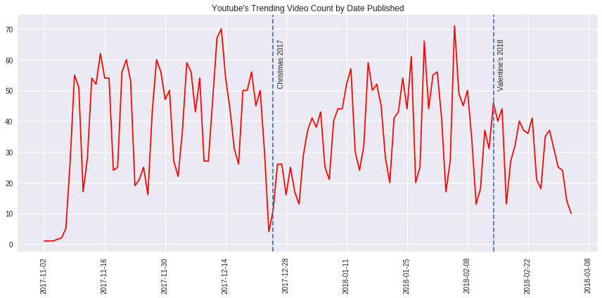

# Analytic Report- Youtube Trending Videos

## Summary

Short and sweet analytic report on a dataset that contains Youtube's trending videos from 2017-18. I set out to produce some visually pleasing plots and answer some analytical questions using T-Tests, to make the most out of the data.

- See a static render of the [notebook](https://miguelniblock.github.io/Analytic-Report_Youtube-Trending-Videos/Deliverables/index.html).